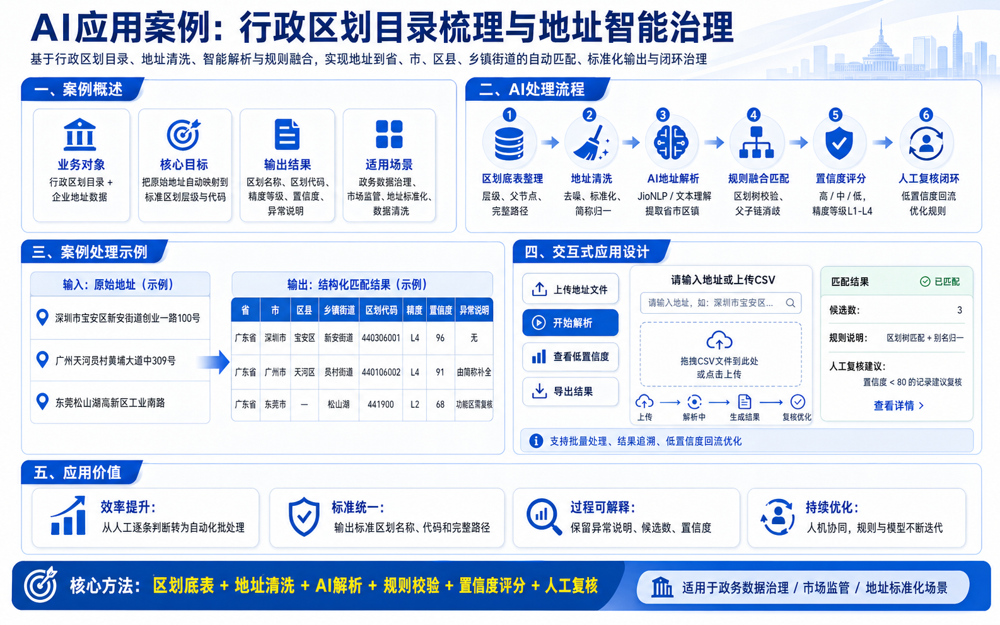
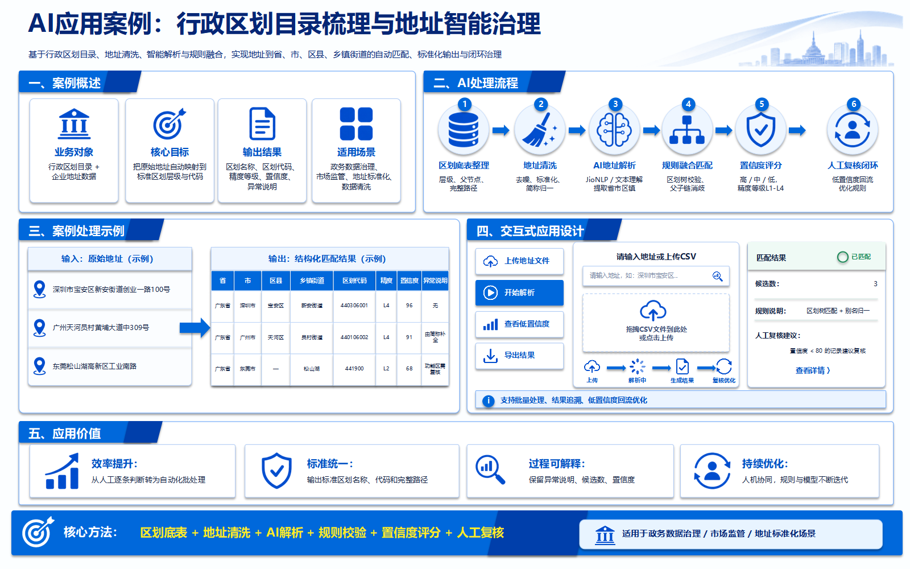
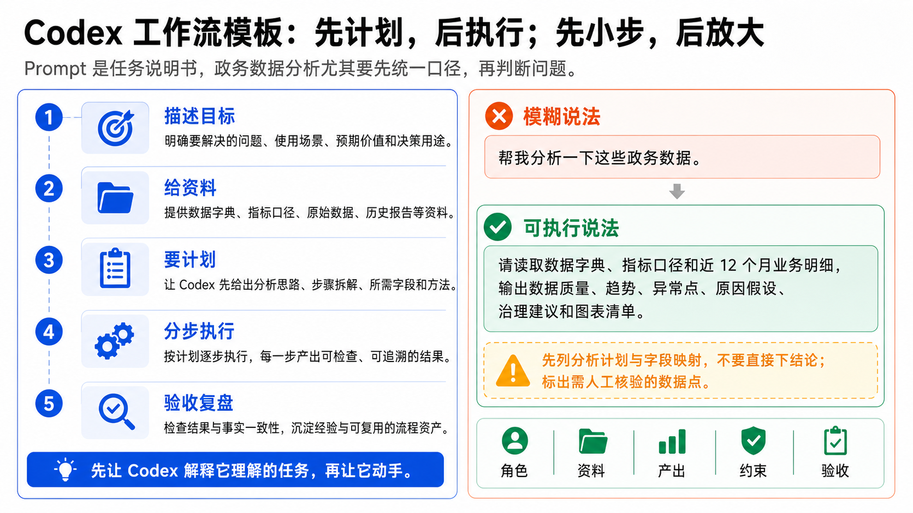
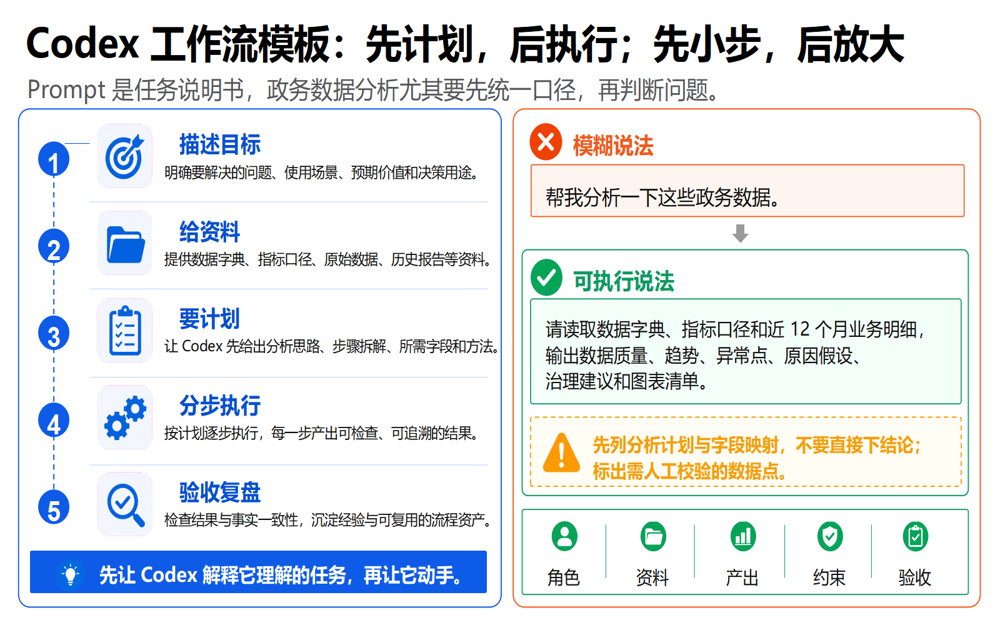
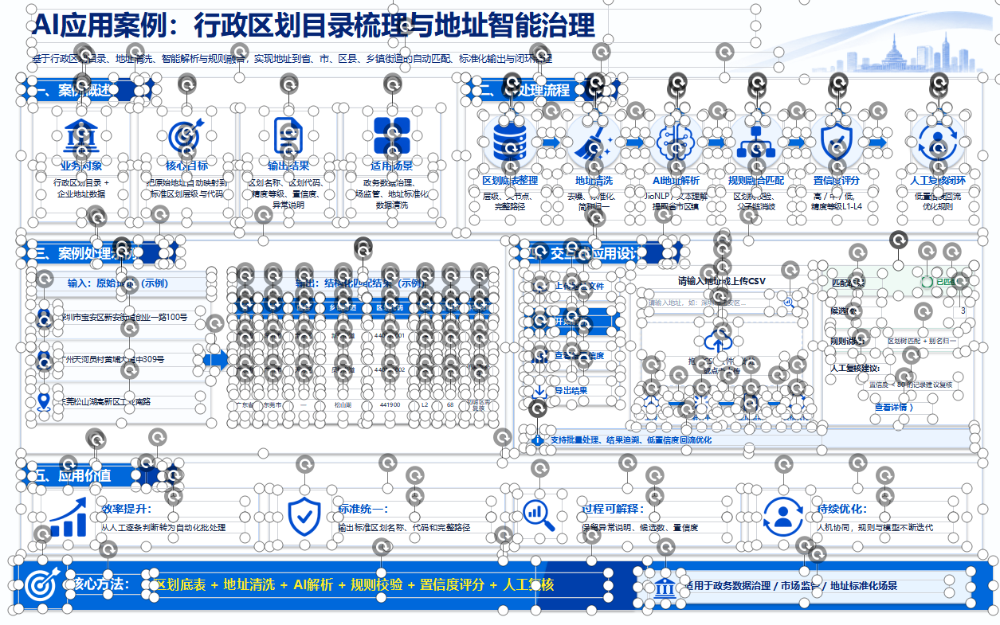
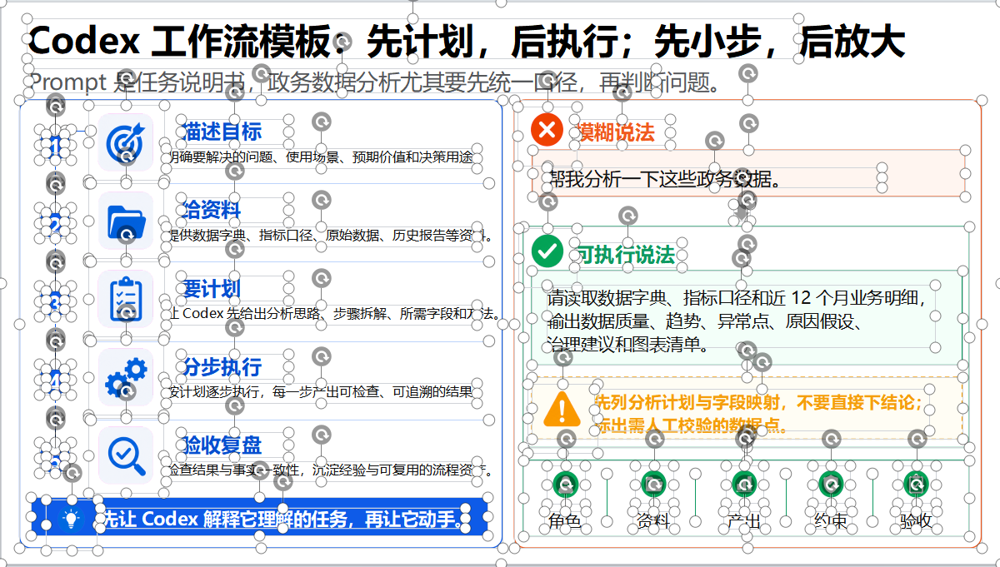
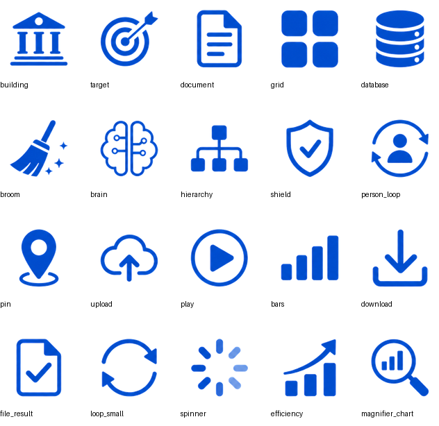
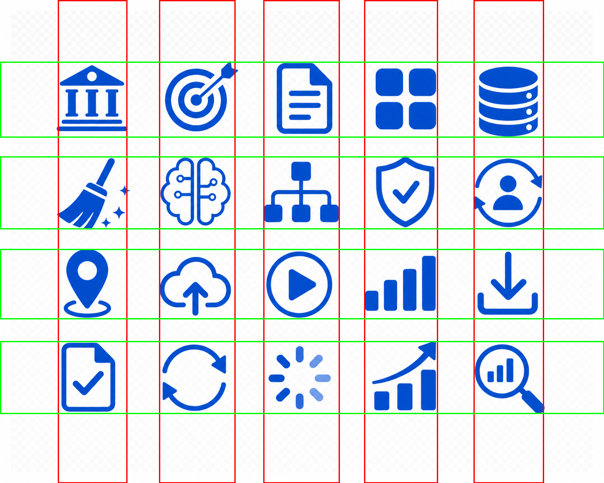

<p align="center">
  
</p>

<h1 align="center">Knight ImageToPPTX Skill</h1>

<p align="center">
  <strong>把截图、图片型 PPTX、PDF 页面复刻成对象级可编辑的 PowerPoint。</strong>
</p>

<p align="center">
  <a href="#skill-定位"></a>
  <a href="#图像资产规则"></a>
  <a href="#质量门禁"></a>
  <a href="#许可"></a>
</p>

<p align="center">
  <sub>Semantic slide rebuilding protocol for Codex · native PPT objects · generated transparent assets · page-by-page visual QA</sub>
</p>

---

## Skill 定位

`knight-imagetopptx-skill` 是一个面向 Codex 的 **图片页转可编辑 PPTX 复刻技能**。

它不是“从零生成一份 PPT”的创作模板，也不是“把图片塞进幻灯片”的打包工具。它给 Codex 提供一套可复用的复刻协议：先拆解现有视觉页，再把文本、表格、卡片、箭头、按钮、图标和复杂视觉资产重建为可继续编辑的 PowerPoint 对象。

适合用在这些任务中：

- 将 PNG / JPG / WebP 幻灯片截图复刻为可编辑 PPTX
- 将图片版 PPTX 按页重建为文字、表格、图标可编辑的 PPTX
- 将 PDF 汇报页、扫描页或图片型 PDF 复刻为 PowerPoint
- 复刻中文商务汇报页、政务信息图、流程图、仪表盘和高密度 UI 截图
- 对图标裁切、CJK 字体、局部渲染差异和复杂资产进行强约束 QA

不适合用在这些任务中：

- 从空白内容创作新 deck
- 只需要整页截图作为背景展示
- SVG-only 转换或纯矢量图标库建设
- 不需要对象级编辑能力的简单归档

## 效果展示

| 原图 | 可编辑复刻效果 |
| --- | --- |
|  |  |
|  |  |

### 元素可编辑状态

复刻结果保留对象级编辑能力：文本、表格、卡片、按钮、图标和复杂视觉资产都可以在 PowerPoint 中独立选中、移动和二次调整。

| 可编辑状态 1 | 可编辑状态 2 |
| --- | --- |
|  |  |

## 核心能力

### 语义化重建

复刻目标不是像素级截图包裹，而是把页面拆成 PowerPoint 可以继续编辑的对象。

- 文本：原生文本框，保留可改字、可调字体、可移动
- 表格：原生单元格、边框、表头和内容区
- 卡片/面板：原生圆角矩形、边框、阴影和填充
- 流程箭头/连接线：PowerPoint 原生形状或可编辑 freeform
- UI 按钮：按钮背景、图标、文字分层独立可编辑

### 生图资产门禁

图标、pictogram、装饰城市线稿、复杂徽章、tiny glyph、插画片段等最终资产必须来自 image generation model。

脚本只负责后处理：切片、透明化、alpha 重打包、边缘清理和插入 PPT。禁止把 PIL / SVG / canvas / 手写路径 / PowerPoint 形状伪装成最终图标资产。

### 通用 C×R / N×N 对齐

资产网格不再写死 `5×4`。skill 要求使用通用 `C×R` 规则：

- `C` = columns，`R` = rows
- `N×N` 网格必须使用正方形画布和 N 行 N 列
- 矩形网格必须让画布比例匹配 `C:R`
- 每个图标居中在自己的 cell center
- 图标限制在 cell 中央 55-65% safe zone
- 每个 cell 内保留至少 20-25% 空白 padding

切图时先检测真实内容网格，再根据 row/column centers 计算 cell edges，避免从 `(0,0)` 用 `image_width / C` 硬切导致图标截断。

### CJK 与 PowerPoint 渲染

中文文本不仅设置 `run.font.name`，还要求在 OOXML 中设置 `a:latin`、`a:ea`、`a:cs`。这样可以减少 PowerPoint 导出时回退到宋体、字号漂移或换行变化的问题。

### 多页输入独立复刻

当输入是多张图片、图片版 PPTX 或 PDF 时，每一页都必须按独立单页规格严格复刻。

默认交付方式是：逐页渲染、逐页对比、逐页修正，最后按原始顺序拼接成一个完整的多页可编辑 PPTX。

## 复刻工作流

### Rebuild Protocol

| 阶段 | Codex 执行内容 | 质量门禁 |
| --- | --- | --- |
| 01 · 输入规整 | 接收图片、图片版 PPTX 或 PDF；渲染/排序为逐页参考图 | 记录页码、尺寸、比例、源文件 |
| 02 · 视觉盘点 | 拆出标题、正文、表格、卡片、按钮、箭头、图标、背景区域 | 为每个非文本对象分配稳定 asset id |
| 03 · 资产分类 | 标记 `native_editable` 与 `imagegen_asset` | 图标和复杂视觉必须进入生图门禁 |
| 04 · 资产生成 | 用生图模型生成独立透明 PNG；必要时做 alpha 清理和网格切割 | 输出 contact sheet 与 grid alignment report |
| 05 · PPT 重建 | 用原生 PPT 对象重建文本、表格、卡片、线条和可编辑结构 | 保持图层、命名、位置和比例可维护 |
| 06 · 渲染校准 | 导出 PPTX 为 PNG，和原图做全页及局部裁图对比 | 修正截断、换行、边距、阴影、字体和对齐 |
| 07 · 多页装配 | 多页输入按原始顺序合并为一个 PPTX | 每页都有独立 QA 证据，不用粗略套模板 |

### QA Trace

每次高质量复刻建议保留以下证据链：

```text
source page
  -> visual inventory
  -> asset manifest
  -> generated asset sheet
  -> transparent PNG assets
  -> rebuilt PPTX
  -> rendered preview
  -> local crop QA
  -> corrected final PPTX
```

这条链路让问题能被定位到具体环节：是生图资产本身截断、切图坐标错误、透明 padding 丢失，还是 PPT 插入和缩放导致的渲染裁切。

## 图像资产规则

### 资产联系图

每个复杂图标都作为独立透明 PNG 资产插入 PPT，便于单独替换、缩放和排查边缘裁切问题。

<p align="center">
  
</p>

### Content-grid cutting

<p align="center">
  
</p>

生成式图标网格常见问题：

- 外圈留白导致硬切错位
- edge cell 源图被模型画到边界外
- 相邻 cell 残片混入目标图标
- 棋盘格背景透明化时误删边缘

skill 要求先检测真实内容网格，再切割，并输出 grid alignment report。若单个图标在源图中已经被截断，则不能靠缩放掩盖，应重新单独生成该资产。

## 安装

将本仓库放到 Codex skills 目录下：

```powershell
$env:CODEX_HOME = "$HOME\.codex"
git clone https://github.com/knight6669/knight-imagetopptx-skill "$env:CODEX_HOME\skills\knight-imagetopptx-skill"
```

或直接把目录放到：

```text
~/.codex/skills/knight-imagetopptx-skill
```

## 使用方式

在 Codex 中触发 skill：

```text
[$knight-imagetopptx-skill](./SKILL.md) 复刻这张图片成可编辑 PPTX
```

可以输入的素材包括：

- 单张 PNG / JPG / WebP 幻灯片截图
- 图片版 PPTX，也就是每页都是截图或整页图片的 PowerPoint
- PDF 页面，例如导出的汇报 PDF、扫描版或图片型 PDF
- 已渲染的 slide page，需要重建为可编辑对象

多页输入规则：

- 每一页都按独立单页复刻，不偷懒套模板
- 每一页都要单独渲染对比和局部裁图检查
- 修正完成后按原始顺序合并成一个 `.pptx`
- 默认交付一个多页可编辑 PPTX，而不是多个零散 PPTX

示例：

```text
[$knight-imagetopptx-skill](./SKILL.md) 复刻这张图片成可编辑 PPTX
```

```text
[$knight-imagetopptx-skill](./SKILL.md) 这个 PPTX 是图片版的，请逐页复刻成文字、表格、图标都可编辑的 PPTX
```

```text
[$knight-imagetopptx-skill](./SKILL.md) 把这个 PDF 里的汇报页复刻成可编辑 PPTX
```

也可以直接提出类似任务：

```text
把这张中文商务汇报截图复刻成可编辑 PPTX，文字、表格、卡片、箭头都要可编辑，图标独立成透明 PNG。
```

## 目录结构

```text
knight-imagetopptx-skill/
├─ SKILL.md
├─ README.md
├─ LICENSE
├─ agents/
├─ scripts/
│  └─ check_rebuild_assets.py
└─ assets/
   ├─ skill-banner.png
   ├─ 原图1.png
   ├─ 效果1.png
   ├─ 原图2.png
   ├─ 效果2.png
   ├─ 元素可编辑状态复刻截图1.png
   ├─ 元素可编辑状态复刻截图2.png
   ├─ comparison.png
   ├─ asset_contact_regenerated_grid资产联系图.png
   └─ new_sheet_projection_runs.png
```

## 质量门禁

```bash
python scripts/check_rebuild_assets.py --asset-dir path/to/assets
```

推荐每个复刻项目都保存：

- rendered preview
- comparison/contact sheet
- local crop QA
- asset manifest
- grid alignment report

完成交付前至少检查：

- 图标没有截断、残片和透明边缘污染
- 中文字体没有回退到宋体或发生异常换行
- 表格、卡片、按钮和流程箭头保持可编辑
- 多页输入中每一页都有独立渲染校准
- 最终文件是一个完整 `.pptx`，而不是零散单页文件

## Roadmap

### Capability Roadmap

| Layer | Direction | Target |
| --- | --- | --- |
| Asset Reliability | 通用 C×R / N×N 资产网格切割器 | 自动检测真实内容边界、cell center、透明 padding 和异常残片 |
| Visual QA | 多区域 QA contact sheet | 自动生成全页、局部、按钮区、底栏、表格区和图标区对比图 |
| Editable Semantics | Selection pane 命名规范 | 为文本、表格、卡片、图标和流程对象建立可读命名体系 |
| Multi-page Engine | PPTX / PDF 批量页复刻协议 | 逐页生成 inventory、manifest、render preview，并合并为单一 deck |
| Style Library | 中文商务与政务版式样例库 | 沉淀高频卡片、蓝色政务风、信息图、流程图和仪表盘复刻模式 |
| Agentic Review | 自动复核与回修循环 | 让 Codex 基于渲染差异生成修正清单并执行二次校准 |

### Release Intent

| Milestone | Focus |
| --- | --- |
| v0.1 | 固化生图资产门禁、CJK 字体规则、基础可编辑复刻流程 |
| v0.2 | 增强图标网格检测、asset manifest、局部 crop QA |
| v0.3 | 强化多页 PPTX / PDF 输入，形成稳定的 page-by-page assembly |
| v1.0 | 建立可复用复刻协议：输入解析、资产生成、PPT 重建、渲染校准、最终交付 |

## 关于作者

Knight | 贺 | 持续探索 vibe-coding

## 许可

MIT License 开源。详见 [LICENSE](LICENSE)。
