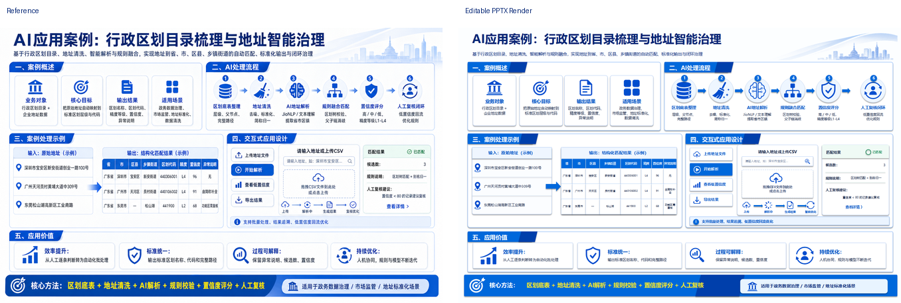
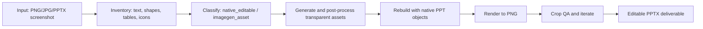

<p align="center">
  
</p>

<h1 align="center">Knight ImageToPPTX</h1>

<p align="center">
  <strong>把截图、图片型 PPT、视觉稿，复刻成真正可编辑的 PowerPoint。</strong>
</p>

<p align="center">
  <a href="#核心特点"></a>
  <a href="#图像资产规则"></a>
  <a href="#许可"></a>
</p>

<p align="center">
  <sub>Semantic slide rebuild skill for Codex · native text/shapes · generated transparent assets · render-first QA</sub>
</p>

---

## 产品定位

`knight-imagetopptx-skill` 是一个面向 Codex 的图片转可编辑 PPTX 复刻技能。

它不是简单把图片塞进 PPT，而是把一张现有幻灯片截图、图片型 PPT 页面或视觉稿，拆解为可编辑的 PowerPoint 对象：文本、表格、卡片、箭头、分隔线、按钮、流程、图标和复杂视觉资产。

适合场景：

- 图片型 PPT 需要变成可编辑 PPTX
- 截图里的中文商务汇报页需要复刻
- 信息图、流程图、仪表盘页面需要保留版式并支持后续编辑
- 需要对密集图标、按钮、表格、CJK 字体和局部裁图做质量控制

不适合场景：

- 从零创作新 PPT
- 只需要把图片打包进 PPT
- SVG-only 转换
- 不需要对象级编辑的简单展示

## 效果展示

| 原图 | 可编辑复刻效果 |
| --- | --- |
|  |  |
|  |  |

### 对比预览

<p align="center">
  
</p>

### 元素可编辑状态

复刻结果保留对象级编辑能力：文本、表格、卡片、按钮、图标和复杂视觉资产都可以在 PowerPoint 中独立选中、移动和二次调整。

| 可编辑状态 1 | 可编辑状态 2 |
| --- | --- |
|  |  |

## 核心特点

### 1. 语义化重建，而不是截图封装

- 文本：使用原生 PowerPoint 文本框
- 表格：使用原生单元格、边框、表头
- 卡片/面板：使用圆角矩形、边框、阴影和背景填充
- 流程箭头/连接线：使用 PowerPoint 原生形状
- UI 按钮：按钮背景、图标、文字分层独立可编辑

### 2. 图标和复杂视觉强制走生图模型

图标、pictogram、装饰城市线稿、复杂徽章、tiny glyph、插画片段等最终资产必须来自 image generation model。

禁止把 PIL/SVG/canvas/手写路径/PowerPoint 形状伪装成最终图标资产。脚本只能做后处理：切片、透明化、alpha 重打包、边缘清理和插入 PPT。

### 3. C×R / N×N 图标网格对齐规则

资产网格不再写死 `5×4`，而是使用通用 `C×R` 规则：

- `C` = columns，`R` = rows
- `N×N` 网格要求正方形画布和 N 行 N 列
- 矩形网格要求画布比例匹配 `C:R`
- 每个图标必须居中在自己的 cell
- 图标限制在 cell 中央 55-65% safe zone
- 每个 cell 内至少 20-25% 空白 padding

切图时不会直接从 `(0,0)` 按 `image_width / C` 硬切，而是先检测真实内容网格，再根据 row/column centers 计算 cell edges。

### 4. CJK 字体和 PowerPoint 渲染细节

中文文本不仅设置 `run.font.name`，还会在 OOXML 中设置 `a:latin`、`a:ea`、`a:cs`，避免 PowerPoint 导出时回退到宋体或发生排版漂移。

### 5. 渲染优先的 QA 工作流

每次复刻都要求实际渲染 PPTX，并检查：

- 全页预览
- 局部密集区域裁图
- 按钮和工具图标裁图
- 底部条、表格、流程、右侧 UI 面板等高风险区域
- asset contact sheet
- grid alignment report

## 图像资产规则

### 生成资产联系图

每个复杂图标都作为独立透明 PNG 资产插入 PPT，便于单独替换、缩放和排查边缘裁切问题。

<p align="center">
  
</p>

### Image-generation gate

最终图标和复杂视觉资产必须有 image generation source。资产清单需要记录：

- `asset_id`
- generated source path
- prompt summary
- final PNG path
- cleanup/cutting operation

### Content-grid cutting

<p align="center">
  
</p>

生成式图标网格常见问题：

- 外圈留白导致硬切错位
- edge cell 源图被模型画到边界外
- 相邻 cell 残片混入目标图标
- 棋盘格背景透明化时误删边缘

本 skill 要求先检测真实内容网格，再切割，并输出 grid alignment report。

## 工作流



## 安装

将本仓库放到 Codex skills 目录下：

```powershell
$env:CODEX_HOME = "$HOME\.codex"
git clone https://github.com/<your-name>/knight-imagetopptx-skill "$env:CODEX_HOME\skills\knight-imagetopptx-skill"
```

或直接把目录放到：

```text
~/.codex/skills/knight-imagetopptx-skill
```

## 使用方式

在 Codex 中触发 skill：

```text
[$knight-imagetopptx-skill](./SKILL.md) 复刻这张图片成可编辑 PPTX
```

你可以输入的素材包括：

- 单张 PNG / JPG / WebP 幻灯片截图
- 图片版 PPTX，也就是每页都是截图或整页图片的 PowerPoint
- PDF 页面，例如导出的汇报 PDF、扫描版或图片型 PDF
- 已渲染的 slide page，需要重建为可编辑对象

示例：

```text
[$knight-imagetopptx-skill](./SKILL.md) 复刻这张图片成可编辑 PPTX
```

```text
[$knight-imagetopptx-skill](./SKILL.md) 这个 PPTX 是图片版的，请逐页复刻成文字、表格、图标都可编辑的 PPTX
```

```text
[$knight-imagetopptx-skill](./SKILL.md) 把这个 PDF 里的汇报页复刻成可编辑 PPTX
```

也可以直接提出类似任务：

```text
把这张中文商务汇报截图复刻成可编辑 PPTX，文字、表格、卡片、箭头都要可编辑，图标独立成透明 PNG。
```

## 目录结构

```text
knight-imagetopptx-skill/
├─ SKILL.md
├─ README.md
├─ LICENSE
├─ agents/
├─ scripts/
│  └─ check_rebuild_assets.py
└─ assets/
   ├─ 原图1.png
   ├─ 效果1.png
   ├─ 原图2.png
   ├─ 效果2.png
   ├─ 元素可编辑状态复刻截图1.png
   ├─ 元素可编辑状态复刻截图2.png
   ├─ comparison.png
   ├─ asset_contact_regenerated_grid资产联系图.png
   └─ new_sheet_projection_runs.png
```

## 质量检查

```bash
python scripts/check_rebuild_assets.py --asset-dir path/to/assets
```

推荐每个复刻项目都保存：

- rendered preview
- comparison/contact sheet
- local crop QA
- asset manifest
- grid alignment report

## Roadmap

- 自动生成多区域 QA contact sheet
- 提供通用 `C×R` 网格资产切割脚本
- 增加 PPTX selection pane 命名规范
- 增加更多中文商务图表和政务风格复刻样例

## 关于作者

Knight | 贺 | 持续探索 vibe-coding

## 许可

MIT License 开源。详见 [LICENSE](LICENSE)。
